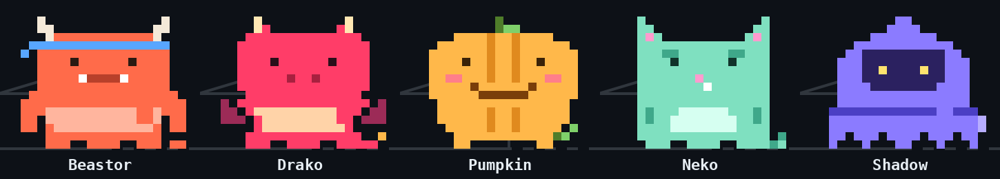

<div align="center">

# 💪 BuffTomo

**A MyBuffBuddy pixel monster that lives on your GitHub profile and reacts to what you actually do.**

Pick Beastor, Drako, Pumpkin, Neko or Shadow. It eats, trains with its
dumbbell, naps, sulks and celebrates based on your real GitHub activity -
rendered to animated SVG by a GitHub Action that lives in *your* repo.

No JavaScript. No hosting. No runtime dependencies.



</div>

---

## Meet the monsters

| Monster | Personality | Banner |
|---|---|---|
| **Beastor** `beastor` | Strong, confident, gym-focused. Horns, fangs, sweatband. |  |
| **Drako** `drako` | Fiery, energetic, ambitious. Wings and a flame-tipped tail. |  |
| **Pumpkin** `pumpkin` | Cheerful, comforting, playful. Rosy cheeks and a vine tail. |  |
| **Neko** `neko` | Agile, curious, mischievous. Stripes and one cheeky fang. |  |
| **Shadow** `shadow` | Calm, mysterious, disciplined. Glowing eyes and a belt. |  |

Can't choose? `monster: random` brings a different one each day (stable
across the day's 6-hourly regenerations).

## Quick start (5 minutes)

**1.** Add this workflow to your profile repo (`your-username/your-username`)
as `.github/workflows/bufftomo.yml`:

```yaml
name: My BuffTomo
on:
  schedule:
    - cron: '23 */6 * * *'   # every 6h - pick your own minute
  workflow_dispatch:

permissions:
  contents: write

jobs:
  pet:
    runs-on: ubuntu-latest
    steps:
      - uses: actions/checkout@v4
      - uses: YuriGuernsey/BuffTomo@v1
        with:
          username: your-username            # change me
          monster: drako                     # beastor | drako | pumpkin | neko | shadow | random
          timezone-offset-minutes: "60"      # your UTC offset in minutes
```

**2.** Embed it in your `README.md`:

```html
<picture>
  <source media="(prefers-color-scheme: dark)" srcset="https://raw.githubusercontent.com/your-username/your-username/main/dist/pet.svg">
  <source media="(prefers-color-scheme: light)" srcset="https://raw.githubusercontent.com/your-username/your-username/main/dist/pet-light.svg">
  
</picture>
```

**3.** Run it once manually (Actions → *My BuffTomo* → Run workflow), or wait
for the schedule. It keeps itself alive from then on.

## What you get

| File | What it is |
|---|---|
| `pet.svg` | Banner scene: the monster's daily routine of eating, training and resting |
| `isocat.svg` | Isometric contribution city with the monster hopping along the weekly peaks |
| `graph.svg` | Flat contribution graph with the monster patrolling the top |
| `langs.svg` | Language share chart |
| `pet-badge.svg` | Mini status badge |

Every SVG also ships a `-light` variant for light-mode profiles.

## The monster is honest

Every state maps to real data (first match wins):

| State | Rule | Visual |
|---|---|---|
| 🔥 overheat | a watched repo's latest CI run failed (24h window) | turns red and steams |
| zoomies | PR merged ≤24h, or ≥3 pushes today | sprints the routine with motion lines |
| sleeping | 00:00–06:00 your local time, nothing pushed ≤6h | eyes shut, gently breathing, floating Zzz |
| content | pushed ≤24h | daily routine + hearts |
| hungry | no pushes for 24–96h | camps at the empty bowl |
| grumpy | no pushes for >96h | sulks in the cardboard box with angry brows |
| 🏆 release | you shipped a release ≤24h ago | trophy next to it |
| 😷 sick | ≥10 open issues across watched repos | stays home with a thermometer |
| 🛌 hibernating | you set `hibernate-until` | sleeps with a back-soon caption |

Also real, just quieter: a day/night sky from your local hour, a streak
campfire (≥3 days), a GitHub-iversary cake, "hacking on X" bubbles from your
last push, weekend shades and lemonade, an October pumpkin, New Year's
fireworks, a "touch grass" sign at 21+ day streaks, and confetti on
star/follower milestones.

## Configuration

| Input | Default | What it does |
|---|---|---|
| `username` | repo owner | Whose activity to watch |
| `monster` | `beastor` | `beastor`, `drako`, `pumpkin`, `neko`, `shadow`, or `random` (daily rotation) |
| `token` | `GITHUB_TOKEN` | Used for the contribution calendar (GraphQL). The default token is enough |
| `timezone-offset-minutes` | `0` | Your UTC offset in minutes - drives sleeping + greeting |
| `watched-repos` | *(empty)* | Comma-separated repos for the overheat state, e.g. `"api,web"` |
| `display-name` | *(auto)* | First name in the greeting (auto-detected from your profile if empty) |
| `pet-name` | species name | Captions read "Drako is sleeping"; set this to rename it ("mochi is sleeping") |
| `hibernate-until` | *(empty)* | `YYYY-MM-DD` planned absence - hibernates instead of going hungry/grumpy |
| `accent-color` | *(empty)* | `#rrggbb` brand colour for accents (e.g. Beastor's sweatband) |
| `contact-line` | *(empty)* | Third guide bubble, e.g. your email. Empty skips it |
| `output-dir` | `dist` | Where the SVGs are written |
| `attribution` | `true` | Appends the BuffTomo / YourTomo credit to the caption strip |
| `force-state` | *(empty)* | Preview only: force one of the 9 states instead of deciding from real data |

## Adding a monster

Monsters live in [`src/monsters.ts`](src/monsters.ts). Each one is a 20×16
pixel grid (rows 0–9 are the head, which bobs while eating; rows 10–15 the
body), a colour map, eye coordinates, two tail frames and an optional
headband/belt. Add it to `MONSTERS` and it works in every view.
`bun docs/build-gallery.ts` regenerates the README banners.

## Running locally

```bash
PET_USER=you PET_MONSTER=neko PET_FORCE_STATE=zoomies bun generate.ts
# or Node 24+: node generate.ts
```

## Credits

BuffTomo is a fork of [YourTomo](https://github.com/prsdx/YourTomo) by
[prsdx](https://github.com/prsdx) - the state machine, scenes and SMIL
animation are theirs. This fork swaps the cat for the
[MyBuffBuddy](#meet-the-monsters) monsters and the yarn for a dumbbell.
MIT licensed, like the original.
